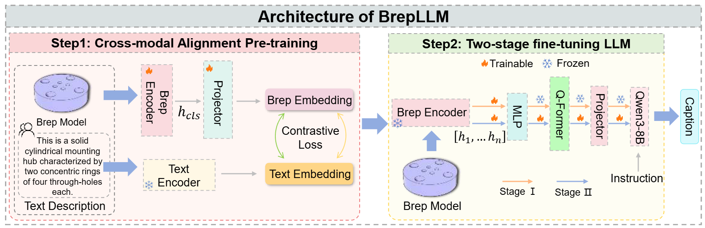

<div align="center">

# BrepLLM

### Native Boundary Representation Understanding with Large Language Models

[Paper](https://arxiv.org/abs/2512.16413) | [Demo](https://user-deng.github.io/BrepLLM/) | [Dataset](https://huggingface.co/datasets/Liyuan03/BrepLLM_data)

</div>

## Overview

BrepLLM is a novel framework that enables large language models (LLMs) to directly understand and reason over native **boundary representation (B-rep)** data. Unlike previous approaches that rely on intermediate formats such as point clouds, meshes, or CAD command sequences, BrepLLM operates directly on the original geometric and topological structure of CAD models.

Key contributions:
- **Hierarchical B-rep Encoder**: Captures both geometric and topological information from native B-rep data.
- **Cross-modal Learning**: Aligns B-rep representations with language through a two-stage training pipeline.
- **Brep2Text Dataset**: A large-scale dataset containing **269K** B-rep and text pairs for training and evaluation.

## Architecture

<div align="center">

</div>

The framework follows a two-stage design:
1. **Cross-modal Alignment Stage**: Learns a shared embedding space between B-rep models and text descriptions.
2. **Multi-stage Fine-tuning**: Integrates the B-rep encoder into a large language model, enabling geometric reasoning and language-based understanding tasks.

## Dataset

The Brep2Text dataset is available on HuggingFace:

| Split | Samples | File |
|-------|---------|------|
| Train | 133K | `brepdata_traindata_133k.json` |
| Test  | 1K | `brepdata_test_1k.json` |

Download: [https://huggingface.co/datasets/Liyuan03/BrepLLM_data](https://huggingface.co/datasets/Liyuan03/BrepLLM_data)

Each sample contains:
```json
{
  "object_id": "0035/00359148",
  "conversation_type": "single_round",
  "conversations": [
    {"from": "human", "value": "<point>\nWhat does this CAD model represent?"},
    {"from": "gpt", "value": "A rectangular block with a flat top and bottom..."}
  ]
}
```

## Demo

Visit the interactive demo page: [https://user-deng.github.io/BrepLLM/](https://user-deng.github.io/BrepLLM/)

Features:
- Interactive 3D CAD model visualization
- Pre-generated BrepLLM analysis for 6 sample models
- Bilingual support (English / Chinese)

## Citation

```bibtex
@misc{deng2025brepllmnativeboundaryrepresentation,
      title={BrepLLM: Native Boundary Representation Understanding with Large Language Models},
      author={Liyuan Deng and Hao Guo and Yunpeng Bai and Yongkang Dai and Huaxi Huang and Yilei Shi},
      year={2025},
      eprint={2512.16413},
      archivePrefix={arXiv},
      primaryClass={cs.CV},
      url={https://arxiv.org/abs/2512.16413},
}
```

## License

This project is released for academic research purposes.
